# Лабораторная работа №0 &mdash; Введение в ОС Ubuntu

## Содержание работы

1. [Введение](#введение)
2. [Открытие терминала](#открытие-терминала)
3. [Основные команды терминала](#основные-команды-терминала)
   - [Перемещение по файловой системе](#перемещение-по-файловой-системе)
   - [Создание и удаление папок](#создание-и-удаление-папок-и-файлов)
   - [Работа с файлами](#работа-с-файлами)
4. [Сетевые возможности](#сетевые-возможности)
   - [Подключение к локальной сети и Wi-Fi](#подключение-к-локальной-сети-и-wi-fi)
   - [Определение IP-адреса](#определение-ip-адреса)
   - [Проверка состояния сервера](#проверка-состояния-сервера)
5. [Работа с командной строкой ОС Ubuntu](#работа-с-командной-строкой-ос-ubuntu)


## Ubuntu: Операционная система

Ubuntu — это, наверное, самый популярный дистрибутив Linux. Он предназначена как для обычных пользователей, так и для разработчиков, предлагая множество инструментов и приложений. Основные преимущества Ubuntu включают:

- **Бесплатность и открытость**: Ubuntu доступна для скачивания и использования без каких-либо лицензионных сборов, что делает её привлекательной для пользователей и организаций.
- **Безопасность**: Открытый исходный код позволяет сообществу быстро выявлять и исправлять уязвимости (это же можно сказать про большинство дистрибутивов Linux).
- **Производительность**: Ubuntu требует меньше ресурсов системы, что делает её более эффективной на старых или менее мощных компьютерах. Это также обеспечивает более быстрый запуск и работу приложений.
- **Настраиваемость**: Пользователи могут изменять практически все аспекты системы, включая интерфейс и функциональность.

### Сравнение с Windows

| Параметр                   | Ubuntu                                | Windows                                      |
| -------------------------- | ------------------------------------- | -------------------------------------------- |
| **Цена**                   | Бесплатно                             | Платно (лицензия требуется, мы же не пираты) |
| **Безопасность**           | Более безопасна, меньше вирусов       | Более подвержена атакам                      |
| **Производительность**     | Легче работает на старом оборудовании | Требует больше ресурсов                      |
| **Настраиваемость**        | Высокая (открытый исходный код)       | Ограниченная настройка                       |
| **Простота использования** | Более сложная для новичков            | Интуитивно понятная                          |
| **Совместимость программ** | Меньше программ, особенно игр         | Широкая совместимость с ПО                   |

## Обзор интерфейса Ubuntu

Рабочий стол Ubuntu представляет собой удобный и интуитивно понятный интерфейс, который включает в себя несколько ключевых элементов. Рассмотрим основные компоненты интерфейса:

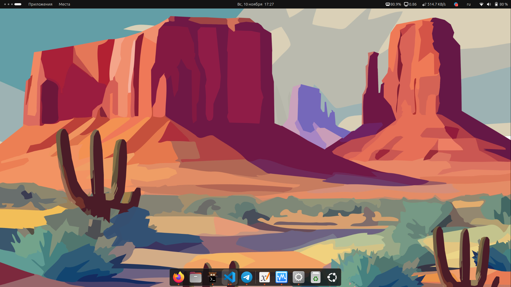

### Панель задач

Панель задач обычно располагается в верхней части экрана и служит для быстрого доступа к основным функциям системы. Она включает в себя:

- **Меню приложений**: Позволяет запускать установленные программы. Вы можете найти нужное приложение, используя поиск или просматривая категории.
- **Иконки запущенных приложений**: Здесь отображаются все активные программы, что позволяет быстро переключаться между ними.
- **Системные индикаторы**: Показывают состояние системы, включая уровень заряда батареи, подключение к сети и другие важные параметры.

Также, на скриншоте выше, можно увидеть дополнительные иконки &mdash; их установил уже лично я, с помощью расширений Gnome Tweaks


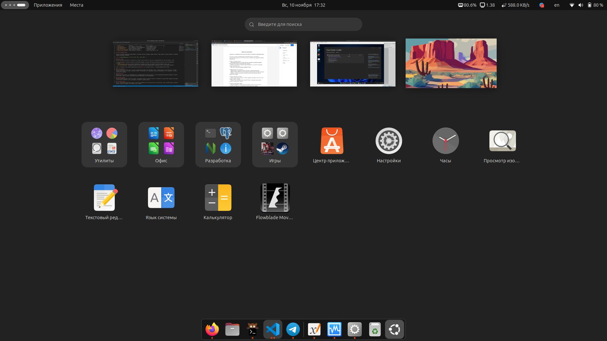

### Меню приложений

Меню приложений предоставляет доступ ко всем установленным программам. Оно может быть открыто с помощью кнопки на панели задач или с помощью клавиши Super (обычно это клавиша с логотипом Windows). В меню можно искать приложения по имени или просматривать их по категориям, что делает навигацию более удобной (нижний скриншот).

### Рабочий стол

Рабочий стол — это область, где пользователи могут размещать ярлыки для быстрого доступа к часто используемым приложениям или файлам. Вы можете перетаскивать иконки на рабочем столе для организации пространства по своему усмотрению.

### Файловый менеджер

Файловый менеджер (например, Nautilus, на скриншоте ниже) позволяет пользователям управлять файлами и папками на компьютере. Он предоставляет графический интерфейс для навигации по файловой системе, копирования, перемещения и удаления файлов.

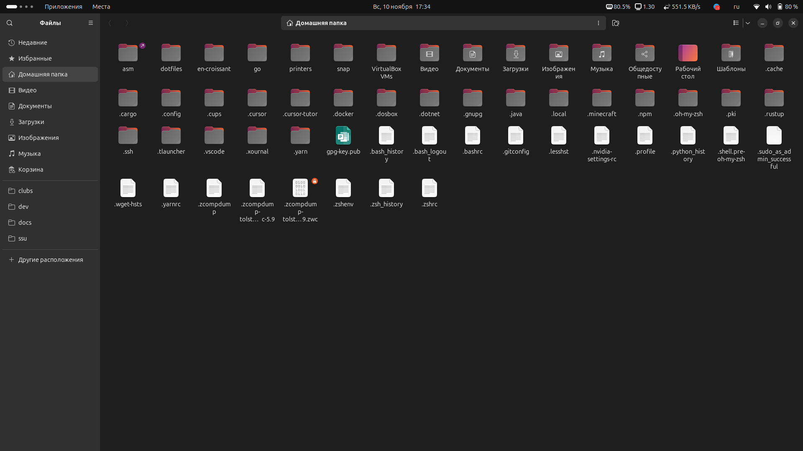

### Настройки системы

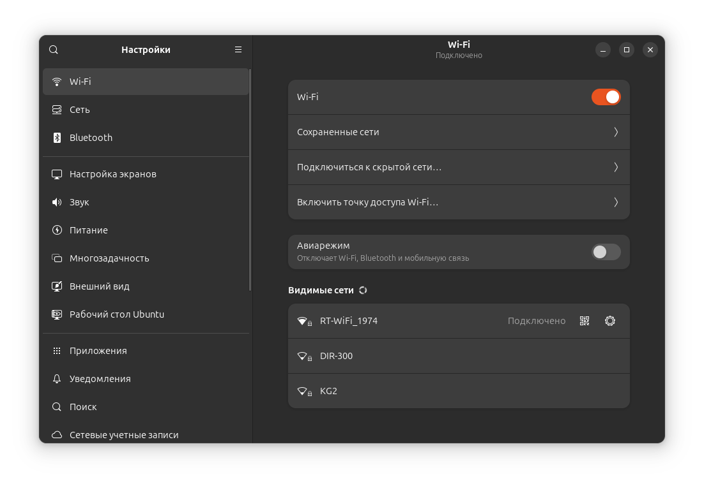

Доступ к системным настройкам можно получить через меню приложений или через значок настроек на панели задач. Здесь вы можете изменять параметры системы, такие как настройки сети, дисплея, звука и другие.

### Работа с окнами

Принцип работы с окнами абсолютно такой же, как и в Windows. Их точно также можно открыть, свернуть, развернуть, закрыть, переместить, расположить в любом месте.

## Приложения и пакеты в Ubuntu

Работа с приложениями и пакетами в Ubuntu осуществляется через несколько инструментов, включая App Center и командную строку. Рассмотрим основные аспекты установки и удаления приложений.

## 1. App Center

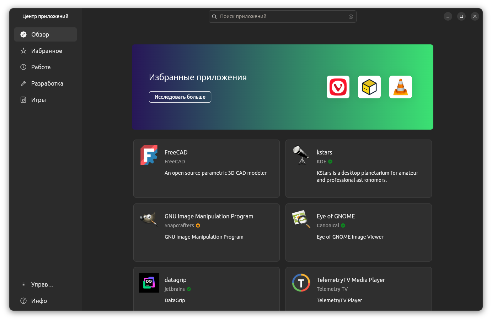

Для установки приложений можно использовать графический интерфейс App Center для Ubuntu.

#### Запуск App Center

Чтобы открыть App Center:

- Найдите его в меню приложений или используйте поиск, введя "Software" в Dash.

#### Установка приложений

1. Откройте App Center.
2. Воспользуйтесь поиском для нахождения нужного приложения или просмотрите категории.
3. Нажмите на приложение, чтобы увидеть его описание и отзывы.
4. Нажмите кнопку **Установить**. Приложение будет загружено и установлено автоматически.

#### Удаление приложений

1. В App Center перейдите в раздел **Установленное ПО**.
2. Найдите приложение, которое хотите удалить.
3. Нажмите кнопку **Удалить** и подтвердите действие.

### 2. Командная строка

Для более опытных пользователей Ubuntu (как и любой нормальный дистрибутив Linux) предлагает возможность управления пакетами через терминал с использованием утилит `apt`, `pacman`, `snap`, `dpkg` или других.

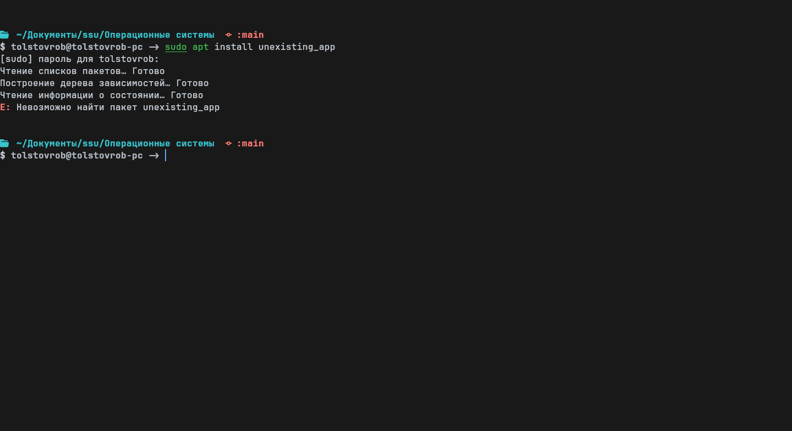

Для установки приложения выполните следующие команды:

```
sudo apt update
sudo apt install имя_пакета
```

#### Удаление приложения через терминал

Чтобы удалить приложение, используйте команду:

```
sudo apt remove имя_пакета
```

### Установка популярных приложений

#### 1. Браузер

Чтобы установить браузер, например Firefox, выполните:

```
sudo apt install firefox
```

#### 2. Офисные приложения

Для установки офисного пакета LibreOffice используйте следующую команду:

```
sudo apt install libreoffice
```

Принцип аналогичен для любых приложений, которые есть в репозиториях установленного пакетного менеджера (`apt`, `pacman`, `snap`, `dpkg`)

## Работа с файловой системой в Ubuntu

Работа с файловой системой в Ubuntu осуществляется (по умолчанию) через файловый менеджер Nautilus, который позволяет выполнять основные операции с файлами и папками. Рассмотрим подробнее, как работать с Nautilus и структуру файловой системы.

### Файловый менеджер Nautilus

#### Основные операции с файлами и папками

Nautilus — это основной файловый менеджер в Ubuntu, который предоставляет пользователю интуитивно понятный интерфейс для управления файлами. Вот основные операции, которые можно выполнять:

1. **Создание папки**:

    

   - Нажмите `Ctrl` + `Shift` + `N`, чтобы создать новую папку.
   - Или щелкните правой кнопкой мыши в пустом месте папки и выберите **Создать новую папку**.

2. **Открытие файла или папки**:

    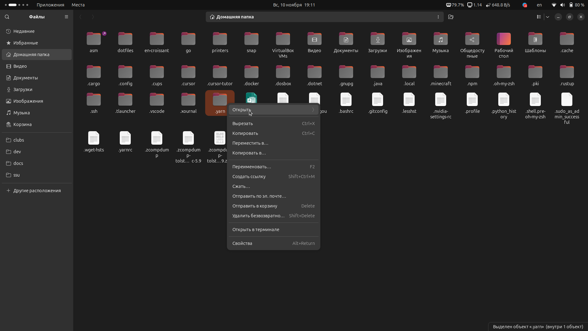

   - Дважды щелкните на нужном файле или папке, чтобы открыть его.
   - Вы также можете щелкнуть правой кнопкой мыши и выбрать **Открыть**.

3. **Закрытие файла**:

   - Закройте окно приложения, в котором открыт файл, как обычно (например, нажатием на кнопку закрытия).

4. **Удаление файла или папки**:

    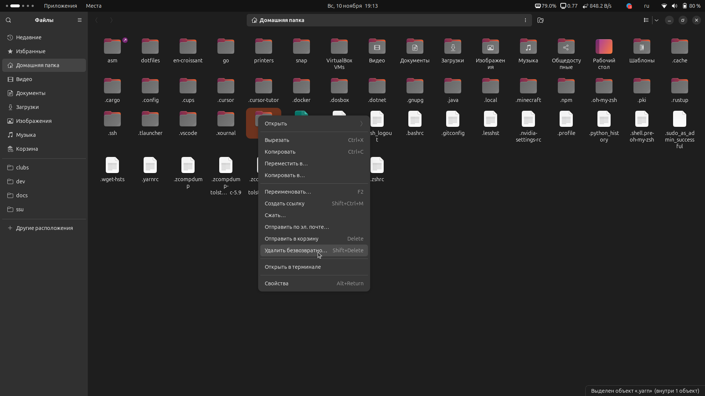

   - Выделите файл или папку и нажмите клавишу `Del`, чтобы переместить объект в корзину.
   - Чтобы удалить безвозвратно, используйте `Shift` + `Del`.

5. **Копирование и перемещение**:
   - Для копирования выделенных объектов используйте `Ctrl` + `C`, а для перемещения — `Ctrl` + `X`.
   - Вставить объекты можно с помощью `Ctrl` + `V`.

#### Структура файловой системы Ubuntu

Файловая система Ubuntu организована в виде дерева, где корневая директория обозначается символом `/`. Основные директории включают:

- **/** (корневая директория): Это верхний уровень файловой системы.
  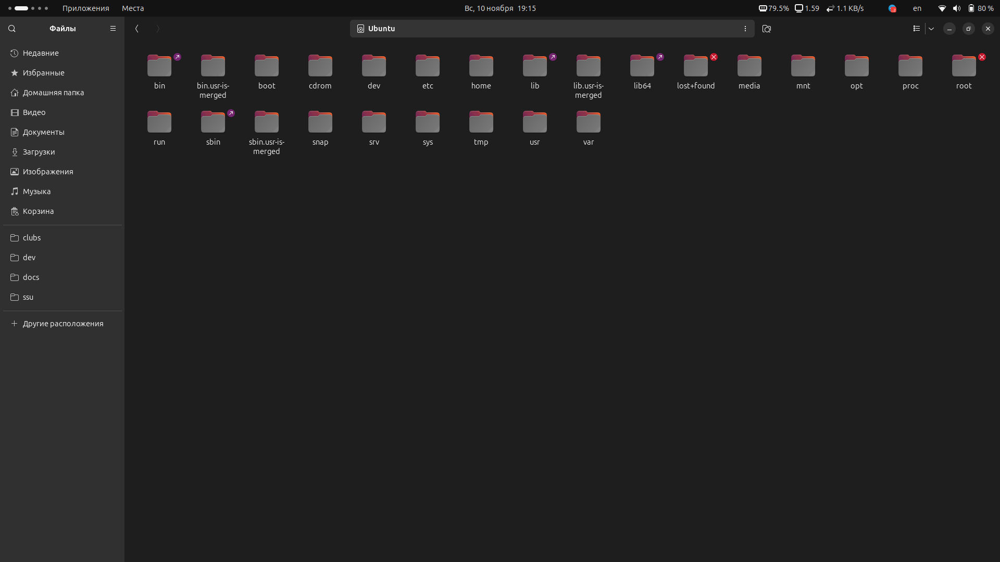
- **/home**: Содержит домашние директории пользователей. Каждому пользователю предоставляется отдельная папка (например, `/home/username`), где он может хранить свои файлы.
  
- **/etc**: Содержит конфигурационные файлы системы.
  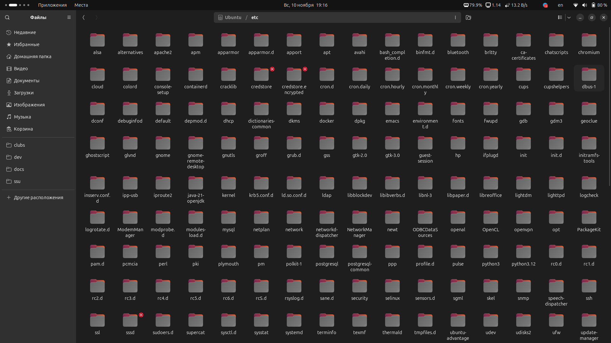
- **/usr**: Содержит пользовательские программы и данные.
  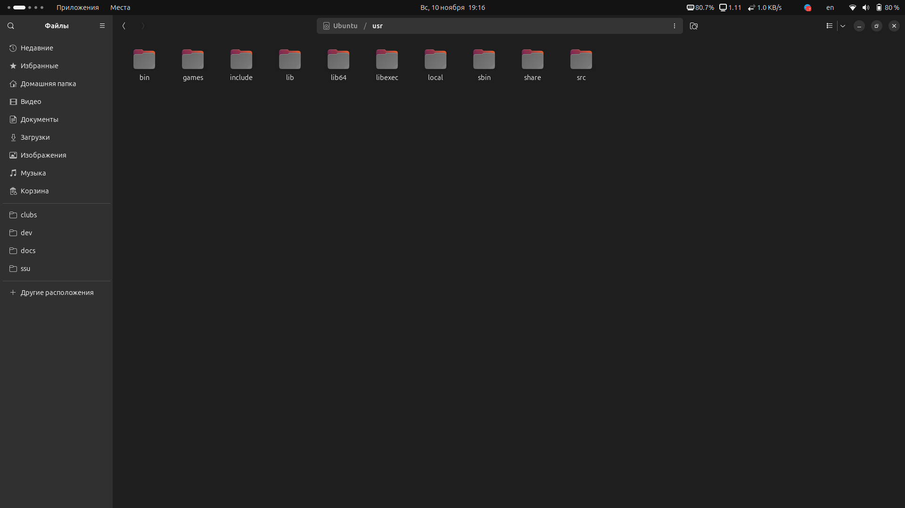
- **/var**: Содержит изменяемые данные, такие как логи и базы данных.
  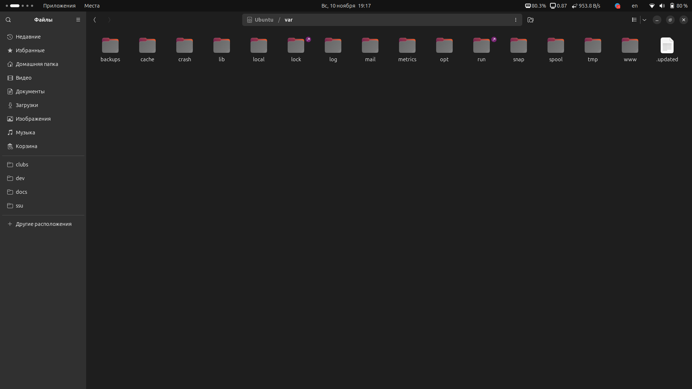

#### Домашняя директория

Домашняя директория пользователя — это место, где хранятся личные файлы и настройки. Она обычно расположена по пути `/home/имя_пользователя`. В ней создаются стандартные папки, такие как:

- **Документы**
- **Загрузки**
- **Изображения**
- **Музыка**
- **Видео**

Эти папки помогают организовать файлы по типам и упрощают доступ к ним.

## Сетевые возможности Ubuntu

Сетевые возможности Ubuntu обеспечивают пользователям гибкость и простоту в подключении к локальным сетям и Wi-Fi, а также в использовании различных сетевых протоколов. Рассмотрим, как подключиться к сети, определить IP-адрес и проверить состояние сервера.

### Подключение к локальной сети и Wi-Fi

#### Подключение через графический интерфейс

1. **Открытие настроек сети**:

      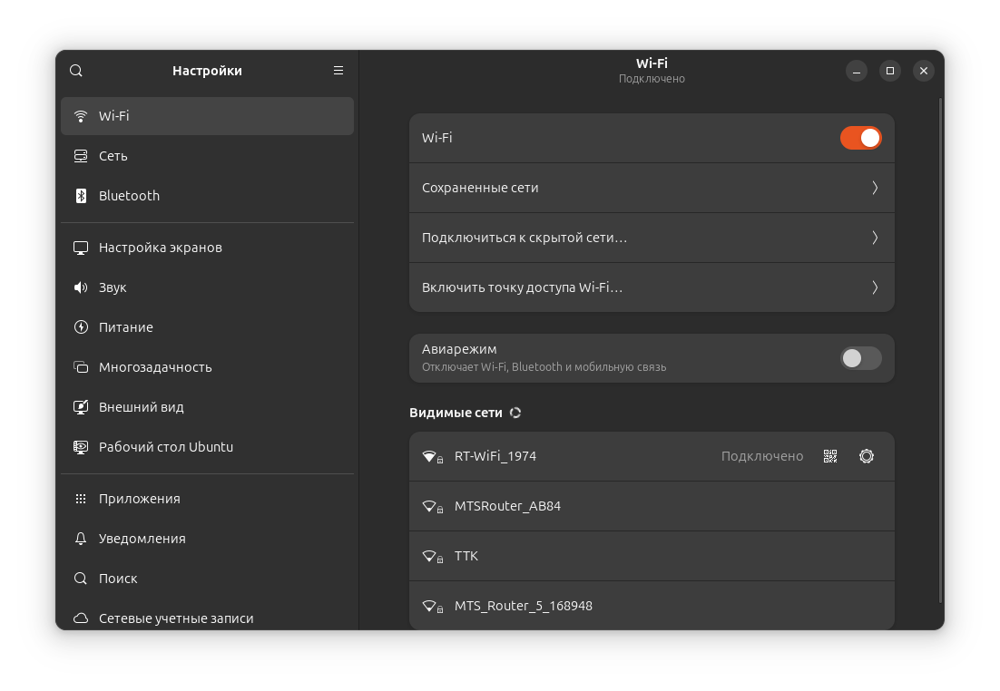

   - Нажмите на значок сети в верхней панели (может выглядеть как значок Wi-Fi или Ethernet).
   - Выберите **Настройки сети**.

2. **Подключение к Wi-Fi**:

   - В разделе **Беспроводные сети** выберите нужную сеть.
   - Введите пароль, если требуется, и нажмите **Подключиться**.

3. **Подключение по Ethernet**:
   - Для подключения по кабелю просто подключите Ethernet-кабель к компьютеру. Ubuntu автоматически определит соединение.

### Определение IP-адреса

Хотя команда `ifconfig` раньше использовалась для определения IP-адреса, она считается устаревшей. Рекомендуется использовать команду `ip`.

#### Определение IP-адреса с помощью команды `ip`

Чтобы узнать IP-адрес вашего устройства, откроем терминал и выполним следующую команду:

```
ip address
```

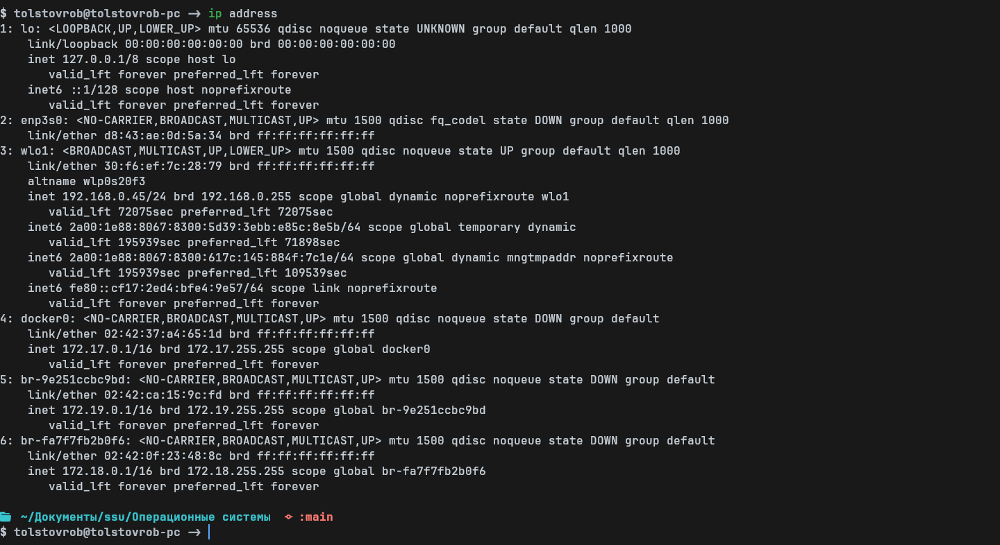

В результате выполнения команды увидим список сетевых интерфейсов и их параметры. Строка, начинающаяся с `inet` показывает локальный IP-адрес.

Пример вывода:

```
inet 192.168.0.45/24 brd 192.168.0.255 scope global dynamic noprefixroute wlo1
```

#### Определение IP-адреса с помощью команды `hostname`

Также можно использовать команду:

```
hostname -I
```

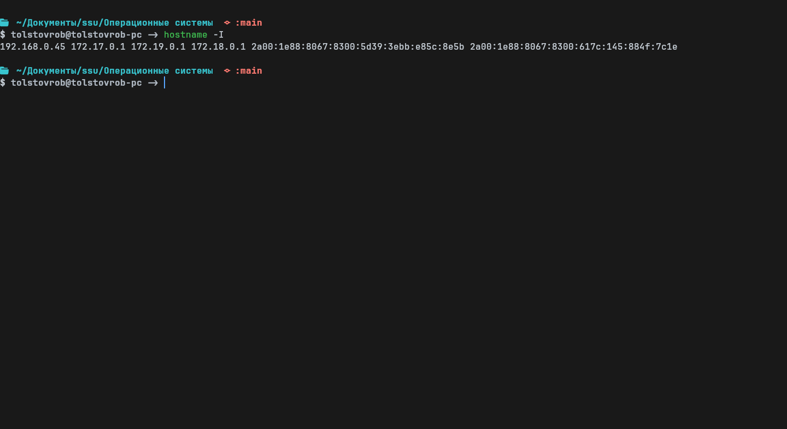

Эта команда выведет все сетевые адреса хоста, кроме loopback интерфейса.

### Проверка состояния сервера

Для проверки состояния сервера, например `sgu.ru`, используем команду `ping`. Эта команда отправляет пакеты на указанный адрес и показывает время отклика.

#### Пример использования команды `ping`

В терминале выполним:

```
ping sgu.ru
```

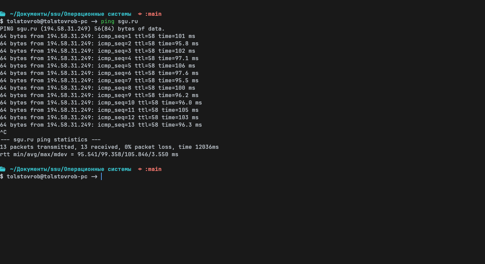

Получаем информацию о времени отклика от сервера и количестве потерянных пакетов.

## Работа с командной строкой ОС Ubuntu

Открытие терминала в Ubuntu позволяет пользователям выполнять различные операции, включая перемещение по файловой системе, создание и удаление папок и файлов, запуск приложений и другие действия. Рассмотрим основные команды и их использование.

### Открытие терминала

Чтобы открыть терминал в Ubuntu, можно:

- Нажать `Ctrl` + `Alt` + `T`.
- Найти "Терминал" в меню приложений.

### Основные команды

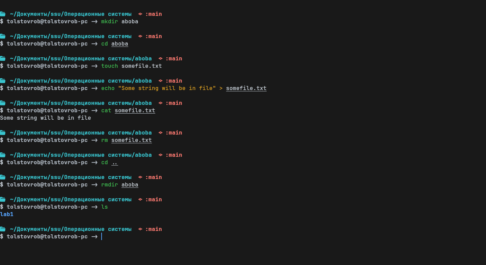

#### Перемещение по файловой системе

- **`pwd`**: Показать текущую директорию.

  ```
  pwd
  ```

- **`cd`**: Перейти в указанную директорию.

  ```
  cd /путь/к/директории
  ```

- **`ls`**: Показать содержимое текущей директории.
  ```
  ls
  ```

#### Создание и удаление папок и файлов

- **`mkdir`**: Создать новую директорию.

  ```
  mkdir имя_директории
  ```

- **`rmdir`**: Удалить пустую директорию.

  ```
  rmdir имя_директории
  ```

- **`rm`**: Удалить файл или директорию. Используйте `-r`, чтобы удалить директорию рекурсивно.
  ```
  rm имя_файла
  rm -r имя_директории
  ```

#### Работа с файлами

- **`touch`**: Создать новый пустой файл или обновить время последнего доступа существующего файла.

  ```
  touch имя_файла
  ```

- **`cp`**: Копировать файлы или директории.

  ```
  cp источник назначение
  cp -r источник назначение   # для копирования директорий
  ```

- **`mv`**: Переместить или переименовать файлы и директории.
  ```
  mv старое_имя новое_имя
  ```

#### Запуск приложений

Чтобы запустить приложение из терминала, просто введите его название. Например, для запуска текстового редактора Gedit:

```
gedit
```
